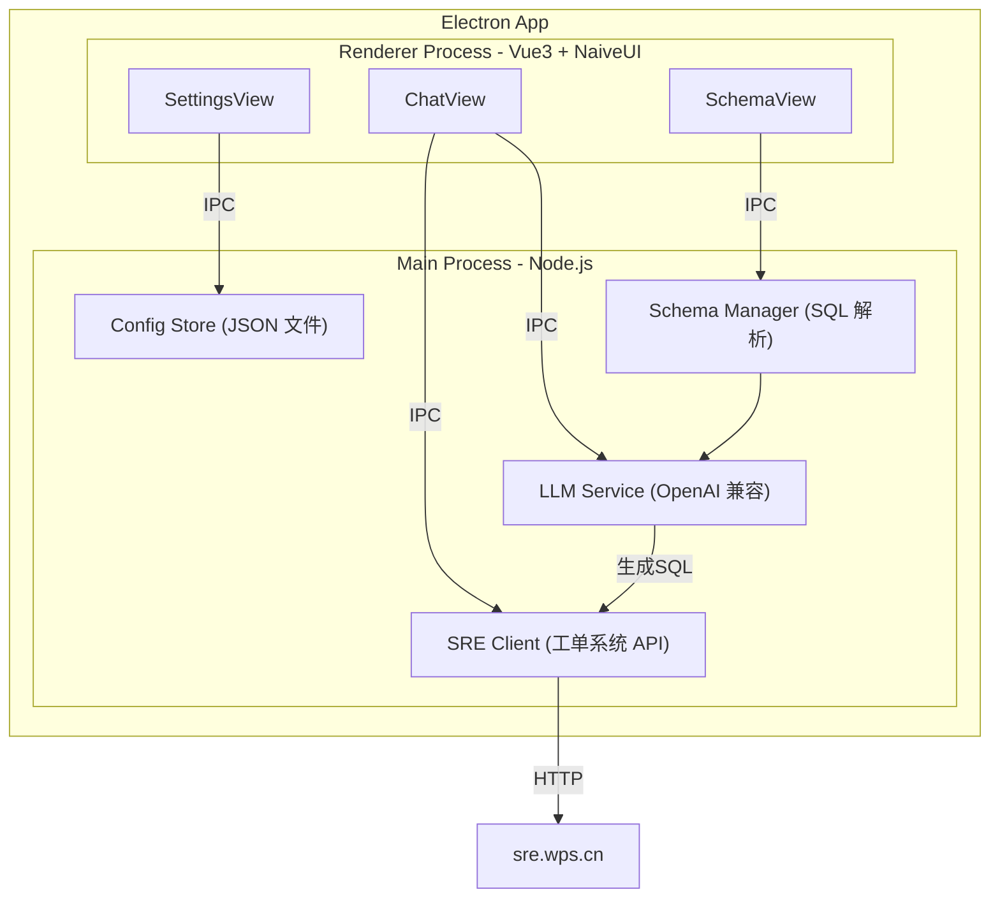
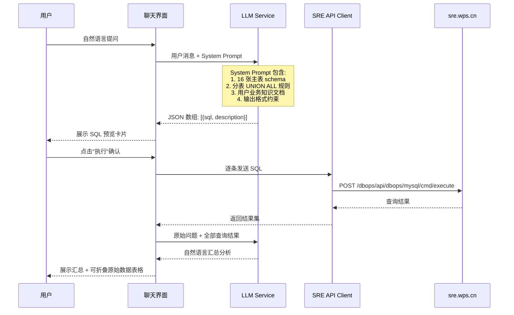
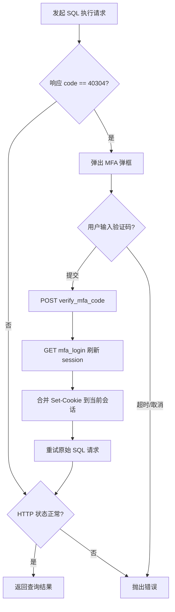
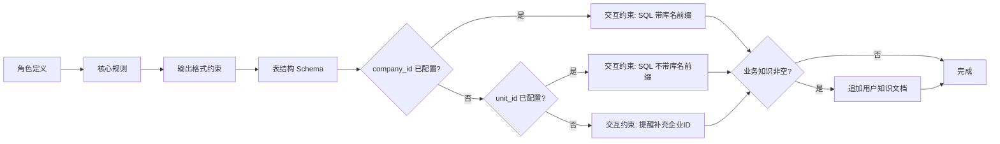
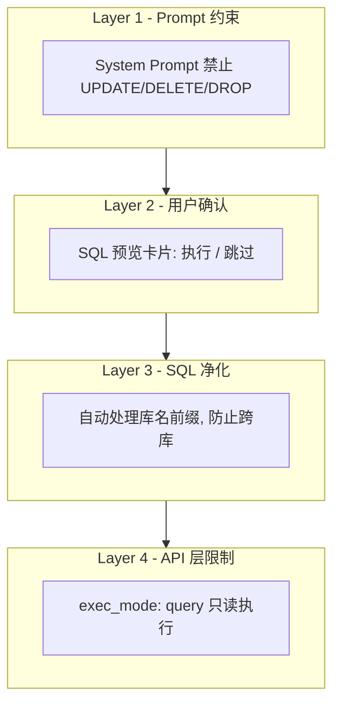

# SQL Assistant 设计文档

## 1. 背景与动机

我们设计了一套微软云文档迁移到自有云文档的系统。每次线上出现数据错误或不一致问题时，需要定位到具体租户的分库，每个库有十几张主表，其中文件表和权限表各有 32 张分表（_00 ~ _31）。手工写 SQL 排障极其痛苦：需要先确定企业 ID、拼数据库名、判断查哪张分表、手动 UNION ALL、再到工单系统提交执行。

SQL Assistant 的目标是将这一过程自动化——在聊天框输入自然语言问题，由大模型自动理解意图、生成 SQL、通过工单系统 API 执行查询、汇总结果，让排障从"写 SQL"变为"问问题"。

## 2. 整体架构



### 设计决策

| 决策 | 选择 | 理由 |
|------|------|------|
| 桌面框架 | Electron | 需要访问内网工单系统，Cookie 管理需在原生层 |
| 前端框架 | Vue 3 + Naive UI (暗色主题) | 轻量、组件丰富、适合工具类 UI |
| 构建工具 | Vite | 开发体验好，HMR 快 |
| 大模型接口 | 兼容 OpenAI Chat Completions | 通用性强，用户可接入任意兼容服务 |
| 配置持久化 | 本地 JSON 文件 | 避免 electron-store ESM/CJS 兼容问题 |
| 数据库访问 | SRE 工单系统 HTTP API | 不直连生产库，通过已有审计链路执行 |

## 3. 核心数据流



### 两轮对话机制

1. **第一轮：生成 SQL** — 用户提问 + System Prompt（schema + 规则 + 知识库）发给大模型，要求返回结构化 JSON
2. **用户确认** — 生成的 SQL 高亮展示，用户逐条决定"执行"或"跳过"
3. **第二轮：汇总分析** — 所有 SQL 执行完毕后，将查询结果发给大模型，生成自然语言汇总

## 4. 数据库结构

数据库名格式：`migrate_project_{企业id}`，一个企业对应一个数据库。

### 主表清单（16 张）

| 表名 | 说明 | 是否分表 |
|------|------|----------|
| `ms_drive` | 微软文档库 | 否 |
| `ms_drive_item` | 微软文档库文件 | 是 (_00~_31) |
| `ms_drive_item_permission` | 微软文件权限 | 是 (_00~_31) |
| `ms_drive_item_raw_permission` | 微软原始文件权限 | 是 (_00~_31) |
| `ms_group` | 微软团队 | 否 |
| `ms_group_member` | 微软团队成员 | 否 |
| `ms_site` | 微软站点 | 否 |
| `user` | 用户映射 | 否 |
| `migrate_stat_entity` | 迁移统计（实体级） | 否 |
| `wps_file` | WPS 文件 | 是 (_00~_31) |
| `wps_file_permission` | WPS 文件权限 | 是 (_00~_31) |
| `wps_group` | WPS 团队 | 否 |
| `wps_group_member` | WPS 团队成员 | 否 |
| `migrate_report_detail` | 报告明细 | 否 |
| `migrate_import_task` | 导入任务 | 否 |
| `migrate_import_task_detail` | 导入任务详情 | 否 |

### 分表查询策略

5 张表各有 32 张分表（后缀 `_00` 到 `_31`），查询时：
- **默认 UNION ALL 所有 32 张分表**，避免用户需要计算分表路由
- **WHERE 条件必须命中索引**（如 `file_id`, `item_id`, `third_id`, `drive_id`），防止全表扫描
- 由大模型在 SQL 中自动生成 UNION ALL 语句

## 5. SRE 工单系统 API

工具不直连数据库，而是通过内部 SRE 工单系统的 HTTP API 执行只读查询。

### 认证方式

用户手动从浏览器复制 Cookie 粘贴到设置页。工具不实现完整登录流程。当 Cookie 过期触发 MFA 时，弹框让用户输入 6 位 TOTP 验证码，工具自动完成验证刷新 session。



### API 接口

| 接口 | 方法 | 用途 |
|------|------|------|
| `/dbops/api/dbops/mysql/unit/{unitId}/databases` | GET | 获取实例下的数据库列表 |
| `/dbops/api/dbops/mysql/cmd/execute` | POST | 执行只读 SQL 查询 |
| `/core/user_center/api/v1/verify_mfa_code` | POST | MFA 验证码校验 |
| `/core/user_center/api/v1/mfa_login` | GET | MFA 登录确认 |

### SQL 执行参数

```json
{
  "command_line": "SELECT ...",
  "db_name": "migrate_project_648787953",
  "limit": 1000,
  "query_time": 30,
  "unit_id": 4925,
  "exec_mode": "query"
}
```

关键约束：`exec_mode` 固定为 `"query"`，工单系统层面保证只读。

## 6. 大模型 Prompt 设计

### System Prompt 结构



各段内容：

**核心规则**：数据库名格式、分表 UNION ALL 规则、索引条件要求、禁止写操作。

**输出格式**：要求大模型返回纯 JSON 数组，每个元素包含 `sql` 和 `description`，工具解析后展示给用户。

**表结构 Schema**：从 `migrate_project.sql` 自动解析，格式化为"表名 → 字段 / 类型 / 注释"的紧凑文本（约 8000 字符），作为 System Prompt 的一部分注入。

**交互约束**：根据用户是否配置了固定 `company_id` 和 `unit_id`，动态生成不同的约束规则：
- 已配置 `company_id`：SQL 中使用 `migrate_project_{id}.表名` 前缀
- 已配置 `unit_id` 但未配置 `company_id`：SQL 中不带库名前缀，由执行参数控制
- 均未配置：提醒用户补充信息

**业务知识**：用户在知识库页面编写的自定义文档（如表关联关系、常见排障场景），直接追加到 Prompt 末尾。

## 7. UI 设计

整体采用**暗色主题**，左侧导航 + 右侧内容区，三个页面。

### 7.1 智能问答页（主页面）

- **顶栏**：连接状态指示 + 清空对话按钮
- **消息流**：支持 Markdown 渲染、SQL 代码高亮、查询结果折叠表格
- **SQL 预览卡片**：每条生成的 SQL 独立展示，带"执行"/"跳过"按钮和状态标签
- **输入栏**：多行文本框 + 发送按钮，Enter 发送
- **MFA 弹框**：Cookie 过期时自动弹出，输入 6 位验证码后自动重试

### 7.2 设置页

- **大模型配置**：API Base URL / API Key（密码框）/ 模型名称
- **SRE 配置**：工单系统地址 / Cookie（多行文本框）/ MySQL 实例 unit_id（动态列表）/ company_id
- 配置实时保存到本地 JSON 文件

### 7.3 知识库页

- **左栏**：内置表结构预览（只读，从 SQL 文件自动解析）
- **右栏**：用户自定义业务知识文档编辑器，支持导入 `.md` / `.txt` 文件
- 内容保存后自动注入大模型 System Prompt

## 8. 项目结构

```
sql-assistant/
├── src/
│   ├── main/                          # Electron 主进程
│   │   ├── index.js                   # 入口，创建窗口
│   │   ├── ipc-handlers.js            # IPC 通道注册
│   │   ├── store.js                   # JSON 文件配置持久化
│   │   ├── sre-client.js              # SRE 工单 API 封装（含 MFA 重试）
│   │   ├── llm-service.js             # 大模型 API 调用（流式 SSE）
│   │   └── schema.js                  # 表结构解析 + System Prompt 组装
│   ├── preload/
│   │   └── preload.js                 # contextBridge 安全 IPC 桥接
│   └── renderer/                      # Vue 3 渲染进程
│       ├── App.vue                    # 根组件（暗色主题、左侧导航）
│       ├── main.js                    # Vue 入口
│       ├── index.html
│       ├── views/
│       │   ├── ChatView.vue           # 聊天页
│       │   ├── SettingsView.vue       # 设置页
│       │   └── SchemaView.vue         # 知识库页
│       └── components/
│           ├── MessageBubble.vue      # 消息气泡（Markdown 渲染）
│           ├── SqlPreview.vue         # SQL 高亮 + 执行/跳过
│           ├── ResultTable.vue        # 查询结果折叠表格
│           └── MfaDialog.vue          # MFA 验证码弹框
├── curl/
│   ├── curls.txt                      # 工单 API 参考（curl 抓包）
│   └── migrate_project.sql            # 数据库完整 DDL
├── vite.config.js
├── package.json
└── README.md
```

## 9. IPC 通信协议

主进程与渲染进程通过 `contextBridge` + `ipcRenderer.invoke` 通信，保持 `contextIsolation: true`。

| 通道 | 方向 | 参数 | 返回值 | 用途 |
|------|------|------|--------|------|
| `config:get` | R → M | `key: string` | 配置值 | 读取配置 |
| `config:set` | R → M | `key, value` | void | 写入配置 |
| `llm:chat` | R → M | `messages: Array` | 完整响应文本 | 调用大模型 |
| `llm:stream` | M → R | `chunk: string` | - | 流式推送 |
| `sre:execute-sql` | R → M | `{unitId, dbName, sql}` | 查询结果 JSON | 执行 SQL |
| `sre:list-databases` | R → M | `unitId: string` | 数据库列表 | 列出数据库 |
| `schema:get` | R → M | - | schema 文本 | 获取表结构 |
| `schema:get-knowledge` | R → M | - | 文档内容 | 读取知识库 |
| `schema:set-knowledge` | R → M | `content: string` | void | 保存知识库 |
| `mfa:request` | M → R | - | - | 请求输入 MFA |
| `mfa:response` | R → M | `code: string` | void | 提交 MFA 码 |

## 10. SQL 安全机制

多层防护确保不会对生产库造成写入风险：



1. **Prompt 约束**：System Prompt 明确禁止生成 UPDATE / DELETE / DROP 等写操作
2. **用户确认**：大模型生成的 SQL 必须经用户点击"执行"后才会发送
3. **SQL 净化**：渲染进程在执行前会自动处理库名前缀（strip 或 add），避免跨库误操作
4. **API 层限制**：工单系统 API 的 `exec_mode: "query"` 参数保证只读执行

## 11. 构建与打包

```bash
# 开发模式
npm run dev:electron

# 构建渲染进程
npm run build

# 打包 Windows 可执行文件（portable 目录）
npm run pack

# 打包 Windows 安装包（NSIS）
npm run dist
```

打包产物位于 `release/win-unpacked/`，直接复制整个目录即可作为 portable 版使用。

## 12. 已知限制与后续演进

| 项 | 当前状态 | 后续可做 |
|----|----------|----------|
| 认证 | 手动粘贴 Cookie | 集成完整 SSO 登录流程 |
| 分表路由 | 全量 UNION ALL | 根据分表键计算精确分表 |
| 聊天记录 | 保存在本地 JSON | 支持导出 / 搜索历史 |
| 多实例 | 仅支持单 unit_id 执行 | 支持跨实例批量查询 |
| SQL 编辑 | 仅支持执行或跳过 | 支持用户在线编辑 SQL 后执行 |
